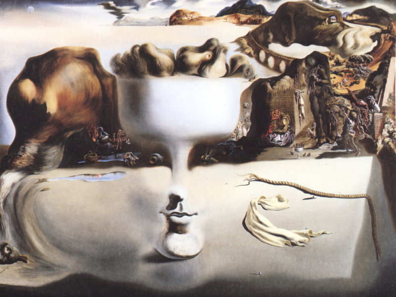
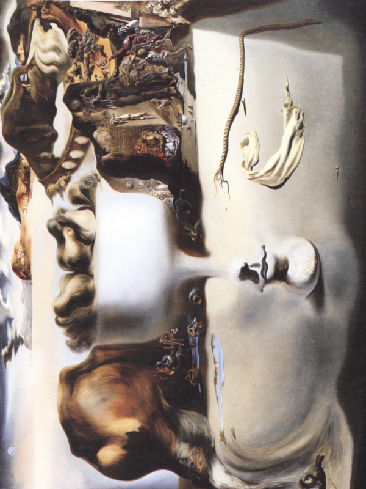

Fauxtoshop is a simple program written in C that allows you to rotate BMP (BitMaP) images by 90 degrees clockwise. This tool is useful for manipulating BMP images without the need for complex image editing software.

## How to run it 

Both on Linux and Windows: 

`gcc fauxtoshop.c -o fauxtoshop`

And then you can run it like so:

`./fauxtoshop < input_image.bmp > rotated_image.bmp`

## Input 

Fauxtoshop accepts BMP images as input. Make sure the input image is in the BMP format and has 24-bit color depth.

## Output
The rotated image will be saved as a new BMP file with the name specified during redirection.

## Example execution with the provided bmp

`./fauxtoshop < Apparition_of_Face_and_Fruit.bmp > rotated_img.bmp`

Before:

After:  

**Note:** This project is the 1st exercise of 3rd assignment of Introduction to Programming 2023-24 (Κ04) course of DIT NKUA.